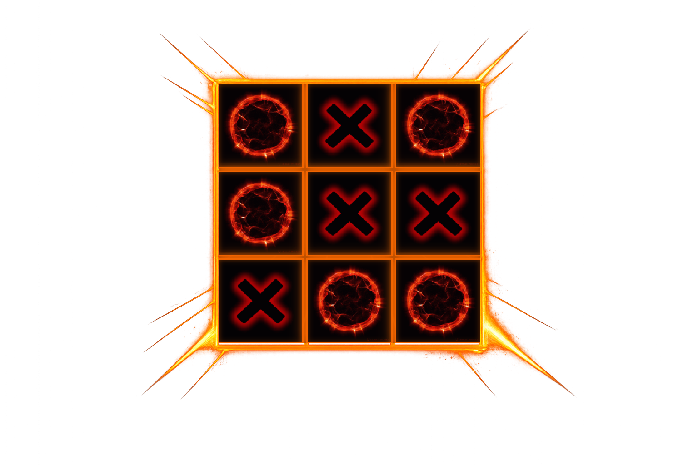
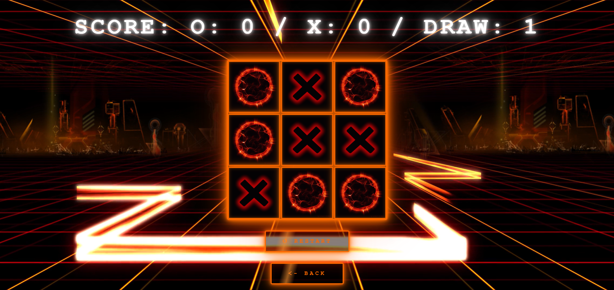

<a id="readme-top"></a>

<!-- PROJECT SHIELDS -->


<!-- PROJECT LOGO -->
<br />
<div align="center">
  <a href="https://github.com/AntonioDS1/vue-tictactoe">
    
  </a>

  <h3 align="center">TicTacToe</h3>

  <p align="center">
    Un TicTacToe minimalista con effetti visivi e sonori, sfondo video animato e modalità multigiocatore.
    Costruito con Vue 3, Vite e Tailwind CSS.
    <br />
    <a href="https://github.com/AntonioDS1/vue-tictactoe"><strong>Visita la repository »</strong></a>
    <br />
    <a href="https://github.com/AntonioDS1/vue-tictactoe](https://vue-tictactoe-two.vercel.app"><strong>Visita la demo »</strong></a>
    <br /><br />
    <a href="https://github.com/AntonioDS1/vue-tictactoe/issues">Segnala un Bug</a>
    ·
    <a href="https://github.com/AntonioDS1/vue-tictactoe/issues">Richiedi una Feature</a>
  </p>
</div>

---

## 🎮 Overview



**TicTacToe** è un'applicazione web moderna che porta il classico gioco del tris a un livello superiore, con un'interfaccia coinvolgente, effetti sonori, sfondo video animato e feedback visivi per ogni mossa.

Il progetto si concentra su:
- architettura Vue 3 modulare con Composition API
- gestione dello stato con `provide` / `inject`
- routing client-side con Vue Router
- UI reattiva e animata

Pensato come **progetto frontend di portfolio**, non solo come demo.

<p align="right">(<a href="#readme-top">back to top</a>)</p>

---

## ✨ Funzionalità principali

### 🔹 1. Partita Multigiocatore
Due giocatori si alternano sullo stesso dispositivo, con rilevamento automatico della vittoria e del pareggio.

### 🔹 2. Effetti Visivi per ogni Mossa
Ogni simbolo O e X viene rappresentato da una GIF animata unica, per un'esperienza visiva immersiva.

### 🔹 3. Effetti Sonori
Ogni mossa riproduce un suono dedicato per O e per X, con audio di sottofondo in loop.

### 🔹 4. Sfondo Video Animato
Un video in loop come sfondo per un'atmosfera coinvolgente fin dal primo avvio.

### 🔹 5. Punteggio Persistente per Sessione
Il tabellone tiene traccia dei punti di O, X e dei pareggi per tutta la sessione di gioco.

### 🔹 6. Double Tris
Rilevamento del caso speciale in cui un giocatore completa due tris nella stessa partita.

### 🔹 7. Architettura Vue 3 Modulare
Componenti separati e riutilizzabili (`Casella`, `Griglia`, `Bottone`, `StartScreen`) con stato condiviso via `provide` / `inject`.

### 🔹 8. Routing Client-Side
Navigazione fluida tra schermata iniziale e griglia di gioco tramite Vue Router.

<p align="right">(<a href="#readme-top">back to top</a>)</p>

---

## 🛠️ Built With

- **Vue 3** (Composition API)
- **Vite**
- **Vue Router**
- **Tailwind CSS**
- **JavaScript (ES6+)**
- **HTML5 / CSS3**
- **Google Fonts (Nunito)**

<p align="right">(<a href="#readme-top">back to top</a>)</p>

---

## 🚀 Getting Started

### 1️⃣ Clona la repository

```bash
git clone https://github.com/AntonioDS1/vue-tictactoe.git
```

### 2️⃣ Installa le dipendenze

```bash
npm install
```

### 3️⃣ Avvia in locale

```bash
npm run dev
```

### 4️⃣ Build per la produzione

```bash
npm run build
```

<p align="right">(<a href="#readme-top">back to top</a>)</p>

---

## 📁 Struttura del progetto

```
src/
├── assets/
│   ├── Audio/         # Effetti sonori e audio di sottofondo
│   └── images/        # GIF simboli e video di sfondo
├── components/
│   ├── Bottone/       # Bottone riutilizzabile (restart / back)
│   ├── Casella/       # Singola cella della griglia
│   ├── Griglia/       # Logica di gioco e layout griglia
│   └── StartScreen/   # Schermata iniziale con selezione modalità
├── router/
│   └── index.js       # Configurazione Vue Router
├── App.vue
└── main.js
```

<p align="right">(<a href="#readme-top">back to top</a>)</p>

---

## 🌐 Repository

🔹 **GitHub**


👉 [https://github.com/AntonioDS1/vue-tictactoe](https://github.com/AntonioDS1/vue-tictactoe)


🔹 **Vercel**


👉 [[https://vue-tictactoe-two.vercel.app/](https://vue-tictactoe-two.vercel.app/)]


<p align="right">(<a href="#readme-top">back to top</a>)</p>


---


## 📬 Contatti


**Antonio De Siena**


GitHub: 👉 [https://github.com/AntonioDS1](https://github.com/AntonioDS1)


<p align="right">(<a href="#readme-top">back to top</a>)</p>
